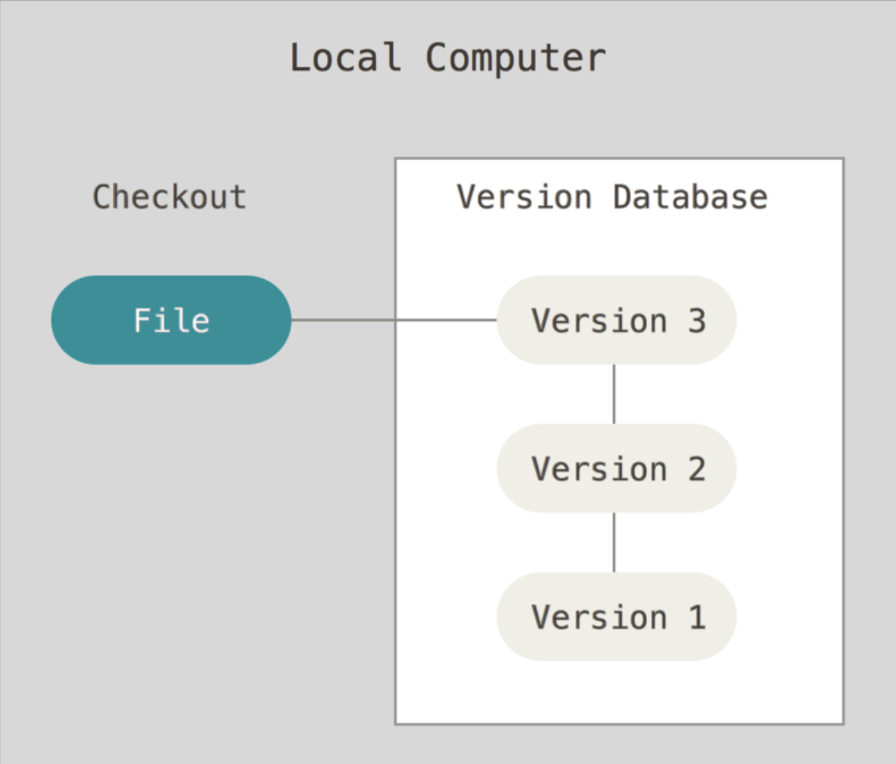
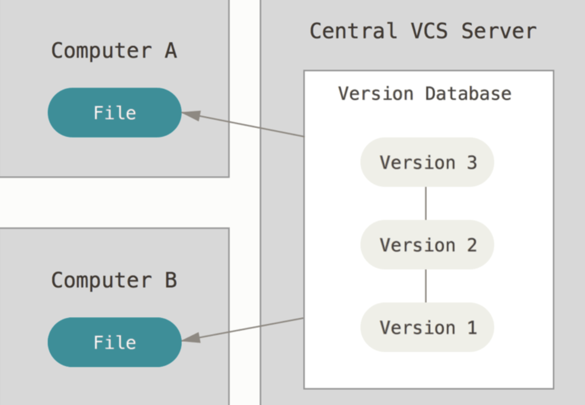
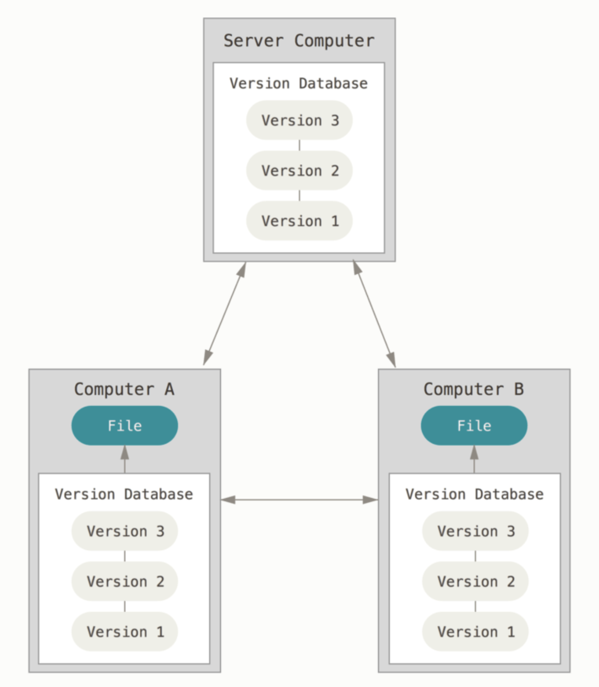
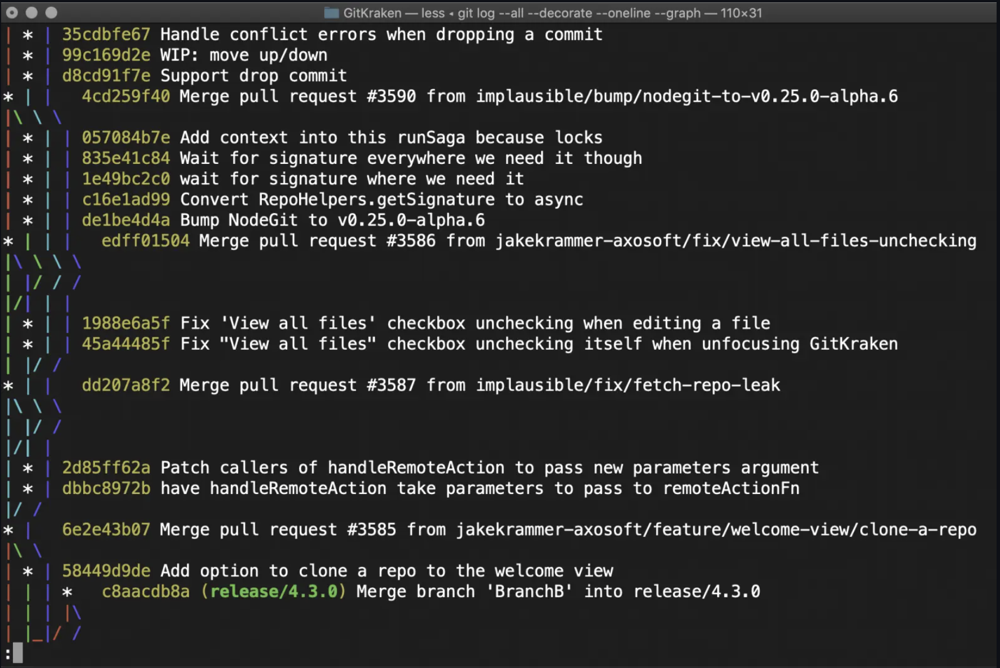
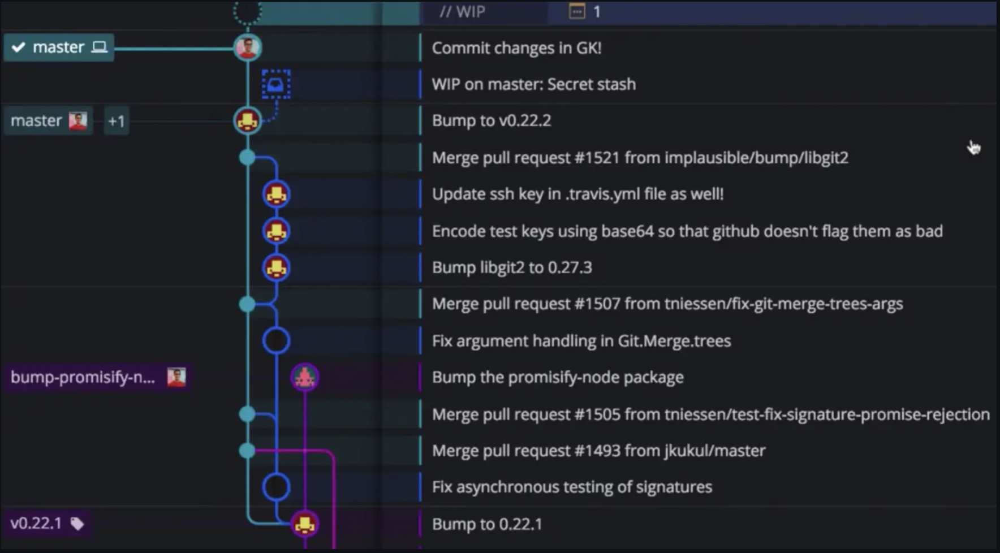

## git이 뭐지?

개발 공부를 하다 보면 이곳저곳에서 ‘git’이라는 단어를 만나게 된다. 또한 대부분의 개발자 JD에서도 ‘git’이 언급된다. 이는 곧 개발 업무에 git이 필수적인 존재라는 것을 의미한다. 도대체 git이 뭐길래 개발과 뗄 수 없는 관계에 있는 것일까?

git을 한 마디로 정의하면 ‘버전 관리 시스템(Version Control System)’이다. 그렇다면 여기서 버전 관리는 또 뭔가 하는 질문이 나올 수 있다. 쉽게 이야기하면 나의 작업 내역을 시간에 따라 기록하고 있다가 원하는 시점의 작업 내역을 다시 불러올 수 있는 시스템이다. 내가 작업을 남겼던 시점들은 각각의 버전을 갖게 되고, 이 버전들을 자유롭게 넘나들 수 있다.

애플리케이션을 개발하는 것과 버전 관리가 당최 뭔 상관이 있을까? 이와 관련된 이야기는 후술하도록 하겠다.

 
 

git은 몇가지 특징을 갖고 있다.

##### Open Source

git의 최대 장점은 모두에게 열려 있는 오픈 소스라는 것이다. 누구나 git을 사용해 프로젝트를 관리할 수 있고 무료로 github에 repository를 생성해서 소스 코드를 업로드할 수 있다.

##### Small & Fast

git은 거의 대부분의 작업이 로컬에서 이루어지므로 속도가 빠르다. 또한 리눅스 커널에서 동작하기 때문에 대용량의 repository를 효과적으로 처리할 수 있다.

##### Distributed

git은 분산 버전 관리 시스템을 갖추고 있다. 로컬에 원격 저장소의 데이터를 클론하는 방식이기 때문에 원격 저장소를 클론한 각 로컬마다 데이터가 백업된다.

##### Branching & Merging

git에는 branch와 merge라는 개념이 있다. 말그대로 git에서는 여러 갈래의 branch를 생성하여 작업할 수 있다. 각각의 branch는 독립적이기 때문에 서로의 변경 사항에 영향을 받지 않는다. 또한 반대로 한 branch를 다른 branch에 합칠 수도 있다. 이 두 개념을 활용해서 git을 사용하는 방식을 'git flow'라고 한다.

##### Staging Area

작업중인 프로젝트의 디렉토리(working directory)에서 추가된 git은 커밋 이전에 staging area라는 상태를 가진다. git 명령어로 따지면 git add와 git commit의 중간 지점에 해당한다. 사용자는 Staging Area에 올라와 있는 파일 중 특정 부분만 골라서 커밋할 수 있다.

 
여기서 잠깐🤚
 
종종 git과 github을 혼동하는 경우가 있는데 둘은 엄연히 다른 개념이다.

github은 git을 기반으로 원격 저장소를 제공하는 일종의 클라우드 서비스이다. 예컨대, git이 커피라면 github은 카페라고 할 수 있다. github과 비슷한 서비스로 gitlab, bitbucket가 있다.

 
 

## git을 왜 쓰는 거지?

사내에서 나홀로 개발자이거나 프리랜서로 일하지 않는 이상 개발자는 협업을 피할 수 없다. 안그래도 험난한 개발 라이프에서 원만하게 협업하기 위해서는 git과 같은 버전 관리 시스템이 필요하다.

버전 관리의 종류는 크게 세 가지로 볼 수 있다.

#### Local Version Control System

버전 관리 용도의 간단한 데이터베이스를 사용하여 파일의 변경 정보를 관리한다. LVCS는 로컬에서만 동작하기 때문에 협업에는 용이하지 않다.

e.g) RCS(Revision Control System)

#### Centralized Version Control System

중앙의 서버가 파일의 변경 정보를 관리하고 클라이언트는 중앙 서버로부터 특정 버전의 스냅샷을 받아서 사용한다. 여기서 특정 스냅샷을 받는 행위를 'checkout'이라고 표현한다. CVCS는 모든 클라이언트가 중앙 서버에 접속하기 때문에 관리가 편하다는 장점이 있다. 하지만 중앙 서버가 다운되거나 장애가 발생하면 버전 관리가 되지 않고 데이터를 복구하기도 어렵다.

e.g) SVN(SubVersion), CVS(Concurrent Versions System)

#### Distributed Version Control System

DVCS는 서버로부터 특정 버전의 스냅샷을 받아 오는게 아니라 저장소 자체를 클론해온다. 따라서 서버에 문제가 생기더라도 각 클라이언트에 저장소 자체가 백업되어 있기 때문에 서버를 복원할 수 있다. 또한 원격 저장소가 있어 여러 작업자들이 협업하는데 용이하다. 다만 여타 시스템에 비해 다소 복잡하다는 단점이 있다.

e.g) Git, Mecurial, Bazaar

 
 

## git은 어떻게 쓰는 거지?

git을 사용하는 방법으로는 터미널에서 직접 git 명령어를 입력하는 CLI(Command Line Interface) 방식과 Source Tree같은 GUI(Graphic User Interface)를 이용하는 방식이 있다. 둘 중 더 편한 방식을 선택해서 자유롭게 사용하면 된다. 개인적으로는 두 방식을 섞어서 사용하며 IDE에서 제공하는 기능을 사용하기도 한다.

##### CLI

##### GUI

 

git에는 수많은 명령어가 있다. 그 중 대표적인 것들만 몇 가지 살펴보도록 하겠다.

- git init

  명령어를 실행한 디렉토리에 git 저장소가 생성되며 모든 파일들이 git에 의해 트래킹된다.

- git add

  변경된 파일을 staging area(또는 index)에 추가한다.

- git commit

  staging area에 올라와 있는 변경된 파일이 HEAD에 반영된다. 커밋은 git 저장소에 디렉토리에 있는 모든 파일에 대한 스냅샷을 기록한다. 각 커밋은 저장소의 이전 버전과 다음 버전의 변경 내역을 저장한다.

- git branch

  명령어를 실행한 브랜치에서 새로운 분기의 브랜치가 생성된다. 브랜치는 하나의 커밋과 그 부모 커밋들을 포함하는 작업 내역이라고 할 수 있다.

- git push

  커밋한 파일을 원격 서버로 올린다.

- git pull

  로컬 저장소를 원격 저장소에 동기화 시킨다. git fetch와 git merge를 함께 실행한 것과 같다.

 
 
 

### Ref

- https://git-scm.com
- https://rogerdudler.github.io/git-guide/index.ko.html
- https://heekangpark.github.io/git/vcs
- https://www.gitkraken.com/blog/git-gui-vs-cli
- https://www.freecodecamp.org/news/git-and-github-the-basics
- https://learngitbranching.js.org/?locale=ko
